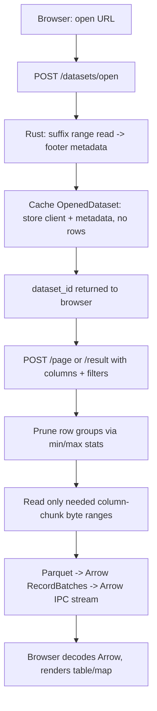

# Show & tell: how Parquet Viewer works

A read-only explorer for Parquet/GeoParquet files that live on remote object storage (S3, HTTP). The Rust backend does the data work; the React frontend does the interaction. This page walks through the whole system end to end: backend internals, how the frontend activates them over the API, why querying is fast, and where it can improve.

## The core idea: never download the file

Parquet is **columnar**. Data is stored as row groups, each containing per-column chunks, plus a footer at the end of the file describing everything (schema, chunk locations, min/max statistics).

The backend treats a 100 GB remote file like a database: it reads the footer with a small HTTP range request, and after that it knows where every column chunk lives — without reading any rows. Every query then fetches **only the byte ranges it needs** via `object_store` (`src/backend/src/engine/source.rs`) and skips everything else.

```text
browser
  ├─ table / schema / diagnostics / map
  ├─ Arrow JS
  └─ MapLibre
       │ JSON control + metadata
       │ Arrow IPC row streams
       ▼
Rust API
  ├─ ranged remote reads
  ├─ Parquet -> Arrow
  ├─ filtering / analysis
  └─ request diagnostics
```



## Backend anatomy

**`CoreEngine`** (`src/backend/src/engine.rs`) is a thin facade over the feature modules:

- **`source.rs` — the range reader.** Implements Parquet-RS's `AsyncFileReader` over `object_store`, so the same code path handles S3, GCS, Azure, plain HTTP, or local files. Every awaited storage call is counted and timed (`ReadMetrics`: calls, ranges, requested vs returned bytes, IO ms) — this feeds the diagnostics panel. Opening uses a *suffix* range read to fetch the footer without a preliminary whole-object read.
- **`dataset.rs` + `registry.rs` — the handle store.** Opening caches an `OpenedDataset` (parsed footer + reusable store client) under a UUID `dataset_id` in an in-memory `HashMap`. No row data — just metadata. Idle handles expire (default 1 hour via `PV_DATASET_IDLE_TIMEOUT_SECONDS`), a cleanup task prunes them, and every lookup refreshes the timestamp. Crucially, later requests **reuse the cached footer** — zero metadata I/O per query.
- **`query/` — execution planning.** Three steps happen before any decode:
  - `pruning.rs` — conservative row-group pruning: if a row group's footer min/max proves the filter cannot match (e.g. `depth > 5000` but the group's max is 200), the group is skipped entirely. Unknown or inexact statistics keep the group; exact evaluation remains authoritative, so pruning never changes results.
  - `filter.rs` — API filter clauses compile into native Parquet-RS `RowFilter` predicates, each with a separate one-column projection. Filtering on `depth` while displaying `id, name` reads the `depth` chunk, discards non-matching rows *during decode*, and never ships those columns to the browser.
  - `projection.rs` — only requested columns are materialized. The geometry column (often the bulk of the file) is never read for a plain table page.
- **`ipc.rs` — streaming.** RecordBatches are encoded incrementally as **Arrow IPC** and pushed through a bounded Tokio channel. Backpressure keeps the producer from running ahead of the network; if the browser is slow, the reader pauses instead of buffering a gigabyte. Trace events distinguish storage wait, reader work, IPC encoding, and queue time.
- **`spatial.rs` — GeoParquet pruning.** For bbox queries, row groups whose per-chunk geometry bounding-box statistics do not intersect the viewport are skipped before any read.

The HTTP layer (`src/backend/src/api/`) is deliberately just plumbing: Axum routes → engine calls → `Body::from_stream` with `content-type: application/vnd.apache.arrow.stream`. JSON is used for control and metadata; row data is always Arrow IPC.

## Frontend: how it activates the backend

All transport goes through one boundary, `src/frontend/src/lib/api.ts`:

1. **Open.** `openDataset(uri)` → `POST /datasets/open` → returns `DatasetInfo` (schema, row count, column stats, geo columns). `App.tsx` holds the `dataset_id` in state; the old handle is best-effort `DELETE`d. The ID is temporary and process-local — after a backend restart or idle expiry, the source must be opened again.
2. **Paging.** Changing page or visible columns fires the effect in `App.tsx` → `pageBatches()` → `POST /datasets/{id}/page` with `{columns, offset, limit, filters}`.
3. **Filtering.** `resultBatches()` → `POST /datasets/{id}/result` streams the complete matching result once; the browser caches the raw Arrow batches and pages locally from then on. Next/previous page and map interaction after a filter are therefore instant — no re-query. Pan/zoom never triggers a Parquet scan.
4. **Streaming decode.** `arrowRequest()` wraps `fetch`'s `ReadableStream` in an async generator of `RecordBatch` via Arrow JS's `RecordBatchReader`. Rows appear as they arrive — the first batch renders while later chunks are still in flight. `AbortController` cancels superseded requests; stale responses are ignored via request IDs.
5. **Diagnostics.** The browser measures its own side (byte arrival, Arrow decode CPU, WKB geometry decode) and polls `GET /diagnostics/{trace_id}` for the backend trace (storage wait, reader work, IPC encode, backpressure). The two sides are kept separate; derived timings are labeled as derived.

## Why querying is fast

| Lever | Effect |
|---|---|
| Footer-first opening | Open = 2 small range reads, not a download |
| Cached metadata | Subsequent queries pay zero metadata I/O |
| Column projection | Skip the geometry chunk entirely on table views — often 95%+ of bytes |
| Row-group pruning | Filters use min/max statistics to skip groups before reading |
| Spatial bbox pruning | Viewport queries read only intersecting row groups |
| Predicate pushdown | Rows filtered during decode; the filter column is read but never sent |
| Arrow IPC end-to-end | Columnar in, columnar out — no JSON row materialization on server or client |
| Bounded streaming | First batch renders immediately; backpressure prevents memory blowups |

The honest caveat: **logical limits are not byte limits** (read amplification). If row groups are huge, "give me 1,000 rows" can still mean hundreds of MiB of I/O — see [Parquet primer](parquet.md). The viewer measures storage bytes/time separately from decode work instead of guessing.

## Where it can improve

1. **Page-level pruning is not exploited.** `pruning.rs` prunes row groups only. ColumnIndex/OffsetIndex page indexes could skip pages *within* a group, but the reader path does not use them yet — and many files lack them anyway.
2. **No column-data cache.** Footer metadata is cached per open dataset (zero metadata I/O per query), but row data is not: every `/page` request builds a fresh reader and re-fetches the column-chunk byte ranges overlapping its row window (row groups fully below the offset are skipped via cached row counts). Consecutive pages inside the same row group re-request its chunks. A small LRU of recent byte ranges (or range coalescing) would cut repeat I/O. Filtered/All results are cached browser-side, so this affects only the unfiltered paging path.
3. **No global sorting.** Row order follows file layout; sorting is reserved in the API contract but not implemented (`api/query.rs` returns 501 for it). Sorting would need a shuffle — a big architectural step.
4. **Pruning is min/max only.** No bloom filters, no dictionary pruning, no partition discovery (e.g. Hive-style directory layouts as virtual datasets). `Contains` filters cannot prune at all.
5. **Filtered results are re-streamed in full.** Changing one filter character re-streams everything; incremental/differential updates do not fit the current single-shot design.
6. **Spatial pruning is coarse.** Row-group bounding boxes help only if row groups are reasonably sized; a GeoParquet bbox column or external spatial index would help more. There is also no geometry simplification for low-zoom map rendering.
7. **Fixed concurrency knobs.** The IPC channel capacity is hardcoded and batch size is static; parallel prefetch of multiple row groups could hide storage latency better.
8. **Analysis UI missing.** The cost-estimation and recommendation endpoints exist and are genuinely useful for diagnosing read amplification — they have no dedicated view yet (see [Frontend](frontend.md)).

## One-line summary

It is a database cursor for a remote file: the footer is the query planner, HTTP ranges are the storage engine, Arrow IPC is the wire format, and every layer skips the bytes it can prove it does not need.
